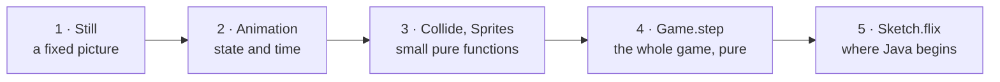
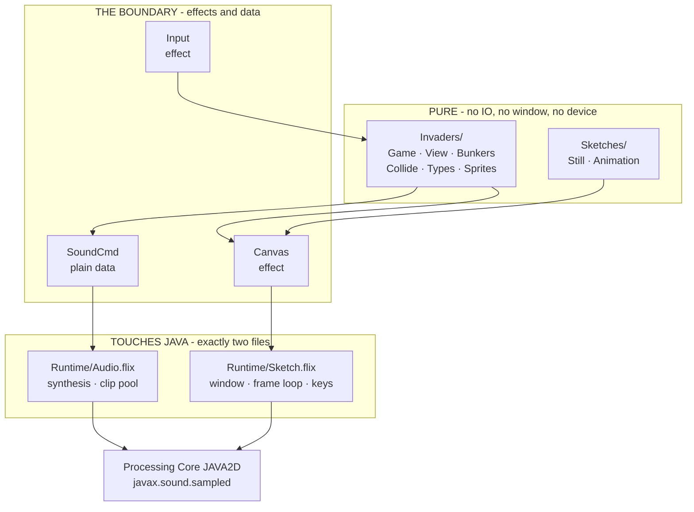
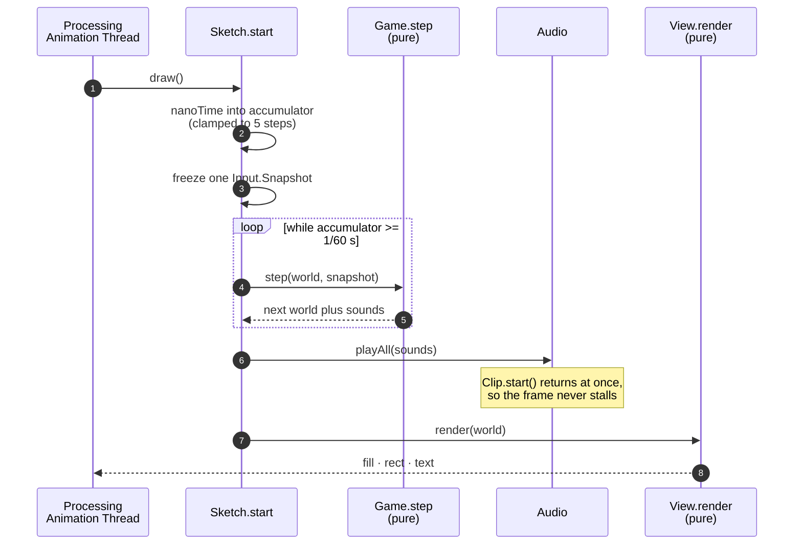
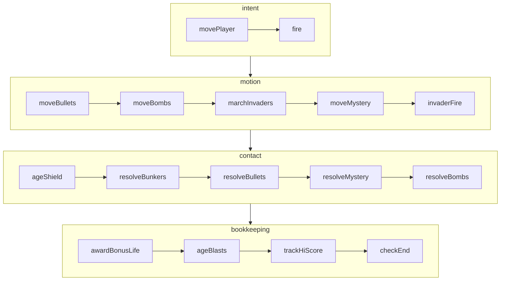
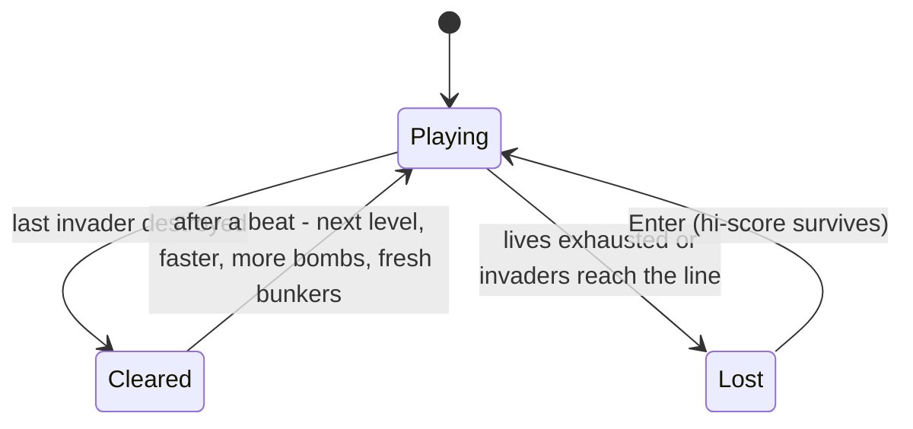
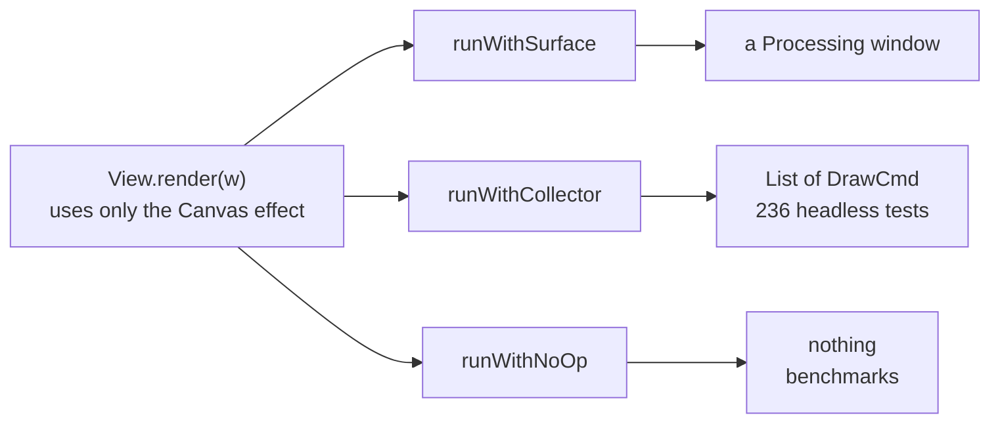

# flix-proc-invaders

A **Flix creative-coding pilot using Processing Core**: an arcade game where the rules are a
pure function, the tests never open a window, and the effect system marks exactly where the
outside world begins.

It is not a Flix dialect, not a Processing Mode, and not affiliated with either project. It
exists to answer one question: *does Flix's effect system make creative coding clearer?*

There is **no Java in this repository**. Flix subclasses Processing's `PApplet` directly.

## Quickstart

You need **Java 21+** and nothing else — the Flix compiler downloads itself on first use.

```sh
git clone https://github.com/wstein/flix-proc-invaders
cd flix-proc-invaders

bin/flix check     # type-check; the fast feedback loop
bin/flix test      # 236 tests -- no window, no audio device
bin/flix run       # play
```

**Controls:** arrows move, space fires, enter restarts. Shelter behind the bunkers — they
stop bombs but wear away. Shoot the saucer for points *and* a temporary shield. Every 1000
points buys a life. Clearing the formation starts a harder level; there is no winning, only
surviving longer.

---

## For students: read it in this order

This codebase is meant to be read, not just run. Each step adds exactly one idea.



| # | Read | Run | The one new idea |
| --- | ------ | ----- | ------------------ |
| 1 | [Sketches/Still.flix](src/Sketches/Still.flix) | `bin/sketch static` | Drawing is a sequence of operations. A window is only one way to interpret them. |
| 2 | [Sketches/Animation.flix](src/Sketches/Animation.flix) | `bin/sketch animation` | A world, and a pure `step` that advances it. No clock, no frame counter. |
| 3 | [Invaders/Collide.flix](src/Invaders/Collide.flix), [Sprites.flix](src/Invaders/Sprites.flix) | `bin/flix test` | Ordinary functions, tested directly. Pixel art is data written as text. |
| 4 | [Invaders/Game.flix](src/Invaders/Game.flix) | `bin/flix run` | The entire game is `(World, Snapshot) -> World`. That is the whole point. |
| 5 | [Runtime/Sketch.flix](src/Runtime/Sketch.flix) | — | Where purity stops and Java starts. One file. |

**Your first change**, in under a minute: open [Still.flix](src/Sketches/Still.flix), change a
colour or move the sun in its `Canvas.ellipse` call, then `bin/sketch static` again.

**Your first real change:** in [Animation.flix](src/Sketches/Animation.flix) set `gravity()`
to `0.15f32` and watch the balls fall. You changed a pure function; nothing else moved.

---

## Architecture

Everything in the top box is pure — no `IO`, no window, no device. It can all be tested
headlessly, and it is.



Exactly **two** files in `src/` mention Java: one for the window, one for the sound card.
Everything else cannot open a device even by accident, because the types forbid it.

## The frame loop

Processing calls `draw()` on its own thread. The runtime turns that into a whole number of
simulation steps, so behaviour never depends on frame rate.



Two properties fall out of this shape:

- **Frame-rate independence.** A slow frame runs *more* steps, not bigger ones. Every step
  covers exactly 1/60 s.
- **Input is frozen once per frame.** Every step in a frame sees the same snapshot, which is
  what lets a recorded run replay exactly.

## The rules, as a pipeline

`Game.step` is one pure function built from small named stages, each readable and tested on
its own.



Order carries meaning. Bunkers resolve *before* invaders, so a bunker genuinely stops a shot.
The saucer resolves *after* the formation, so a bullet must pass everything below it first.
The shield ages *before* anything can grant one, so a new shield lasts its full duration.

## Phases

There is no winning. Clearing the formation starts a harder level; the only ending is losing.



## One effect, three interpretations

This is the idea the whole project exists to demonstrate. `View.render` says *what* to draw
and never learns *where*.



Adding a fourth — a draw-call counter, an SVG exporter — means adding a function to
[Canvas.flix](src/Runtime/Canvas.flix), not touching the runtime.

---

## Design notes

- **Randomness is data, not an effect.** An `Rng` threads through `step` like any other part
  of the world, so a game that uses randomness stays a pure function of its inputs. This was
  forced by a real constraint — an anonymous `PApplet` subclass compiles to a fixed JVM
  method and cannot carry a polymorphic effect — and turned out to be the better design.
- **Sound is data too.** `step` records a `List[SoundCmd]`; the runtime plays it. A machine
  with no sound card runs the identical simulation.
- **Pixel art, no image files.** Sprites are rows of `#` and `.` in
  [Sprites.flix](src/Invaders/Sprites.flix), collapsed into horizontal runs so that 55
  invaders and four bunkers cost about 1.1 ms a frame.
- **Colours are checked, not eyeballed.** [TestContrast.flix](test/TestContrast.flix) asserts
  WCAG 2.1 ratios for the whole palette — 4.5:1 for text, 3:1 for shapes.
- **Balance is a test.** [TestDifficulty.flix](test/TestDifficulty.flix) drives the real game
  with a bot that leads its targets, asserting it gets past level one *and* does not run
  forever. It caught a regression a human had reported.
- **No `@DefaultHandler` on `Canvas` or `Input`, deliberately.** A silent default would let a
  test that forgot to choose an interpretation compile and assert on a frame nobody drew.

## Testing

236 tests, none of which open a window or an audio device — CI enforces that with a grep.

| Area | Tests | What it pins down |
| --- | --- | --- |
| [TestGame](test/TestGame.flix) | 106 | every rule, hit boxes, levels, shield, bonus lives |
| [TestAnimation](test/TestAnimation.flix) | 27 | elastic collisions; conservation of momentum and energy |
| [TestBunkers](test/TestBunkers.flix) | 23 | damage, absorption, erosion |
| [TestSprites](test/TestSprites.flix) | 19 | run-length decomposition of the pixel art |
| [TestCanvas](test/TestCanvas.flix) | 11 | the effect and its interpretations |
| [TestContrast](test/TestContrast.flix) | 10 | WCAG contrast of every palette colour |
| [TestRng](test/TestRng.flix) | 10 | determinism, range, distribution |
| [TestCollide](test/TestCollide.flix) + [TestInput](test/TestInput.flix) | 18 | overlap convention, input edges |
| [TestReplay](test/TestReplay.flix) | 8 | identical input replays to an identical world |
| [TestDifficulty](test/TestDifficulty.flix) | 4 | the game is winnable and not trivial |

## Non-goals

Deliberately out of scope: image and audio assets, networking, persistence, a game engine, a
browser playground, and a Processing Mode. Sprites are text in the source and sounds are
arithmetic — the only binary asset is the arcade font.

## Remix it

The game is one possible outcome, not the point. Roughly in order of effort: change the
[palette](src/Runtime/Palette.flix) (the contrast tests keep you honest); retune the
[rules](src/Invaders/Types.flix) — march speed, fire rate, formation shape; give the invaders
a different movement grammar in `marchInvaders`; change the win condition in `checkEnd`. Each
is a pure function with tests around it.

## Documentation

- [docs/ARCHITECTURE.md](docs/ARCHITECTURE.md) — module graph, threading, determinism, and
  why each boundary sits where it does
- [docs/spike-result.md](docs/spike-result.md) — what the integration spike proved, and the
  non-obvious thing that nearly blocked it
- [docs/SMOKE-CHECKLIST.md](docs/SMOKE-CHECKLIST.md) — the manual per-platform test
- [AGENTS.md](AGENTS.md) — working notes and the gotchas that cost real time

## License

[MIT](LICENSE.md). Links at runtime against Processing Core (LGPL-2.1) and bundles the
Press Start 2P font (SIL OFL 1.1) — see [THIRD-PARTY.md](THIRD-PARTY.md).
