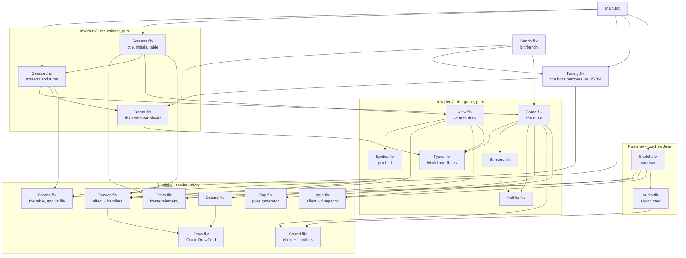
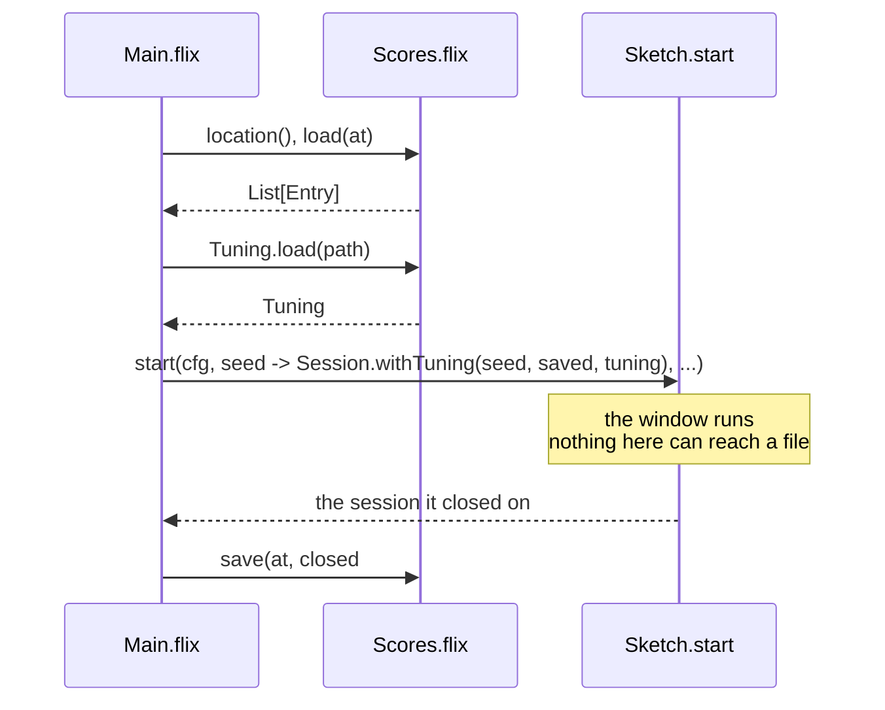
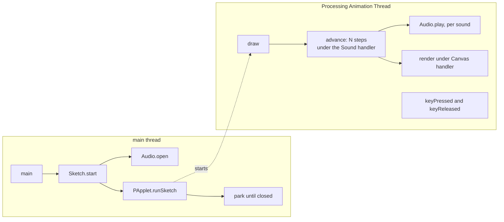
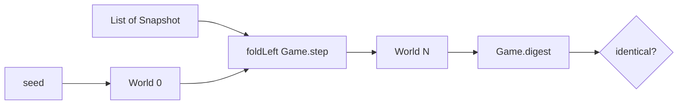
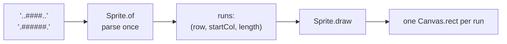

# Architecture

Why each boundary sits where it does, and what it buys.

The short version: **the rules are a pure function, drawing is an effect with several
interpretations, and exactly two files may touch Java.** Everything else follows from those
three commitments.

---

## Module graph

Arrows point from a module to what it depends on. Nothing in `Invaders/` or `Sketches/` can
reach `Sketch.flix` or `Audio.flix` — that direction does not exist.



`Bench.flix` and `Tuning.flix` sit outside the game: they are the measuring tools behind
`bin/bench`, not something the cabinet runs. `Tuning` is the second and last file that reaches
a filesystem.

`Types.flix` holds both the `World` and the `Rules` module — every tunable constant in one
place, so the game can be retuned without hunting through logic.

---

## The three layers

### 1. Pure (`Invaders/`, `Sketches/`)

No `IO`, no window, no device — enforced by types, not convention. `Game.step` is:

```flix
pub def step(world: World, input: Snapshot): World \ Sound
```

One effect, and it is the one the rules genuinely have: saying what should be heard. There is
no `IO` in that row, so `step` cannot read a clock, open a file, or draw. Everything else it
needs — including the random number generator — is a field on `World`.

### 2. The boundary (`Runtime/Canvas`, `Input`, `Sound`, `Fs`)

Three effects of our own, plus the standard library's filesystem effects at the very edge:

| | Kind | Why |
|---|---|---|
| `Canvas` | effect | Drawing reads naturally as a sequence of commands, and several interpretations are genuinely useful |
| `Input` | effect | A `poll` that returns the same frozen snapshot all step |
| `Sound` | effect | The rules say what should be heard; three interpretations decide how |
| `Fs.FileRead`, `Fs.FileWrite` | stdlib effects | Reached only by `main`, and only for the high-score file |

`Rng` is the one thing that stayed data — see *Sound: data or effect?* below for why the two
went different ways.

The filesystem effects are the one place where the type system does *not* protect us:
both carry `@DefaultHandler`, so a test that forgets a handler compiles and writes to the
real disk. CI greps for it. See *Persistence* below.

### Why `Game.step` names one concrete effect and not a variable

`Game.step` is `(World, Snapshot) -> World \ Sound`. A reader coming to Flix for its effect
system may reasonably ask why it is not `\ ef` — polymorphic, so the same rules could be run
with telemetry attached during play and with nothing attached under test. That is the obvious
shape, and it is worth being clear that it is **a limit of the boundary, not a preference**.

`Sketch.start` takes `step` as a callback and installs it on an anonymous `PApplet` subclass.
That subclass compiles `draw` to a fixed JVM method, so `start` cannot be generic over effect
*variables* — the attempt is rejected as `E6469`. A **concrete** effect is fine, which is why
`\ Sound` works and `\ ef` does not. Anything effect-polymorphic in the rules would have to
be made concrete again before it reached the window, which is the whole of the saving.

The rest of the project is effect-polymorphic throughout, and that is where Flix earns its
keep — every handler in it has a signature of the shape:

```flix
pub def runWithCollector(dims: (Int32, Int32), f: Unit -> a \ ef): (a, List[DrawCmd]) \ ef - Canvas
```

`ef` is any effects the caller had; `- Canvas` is the one being discharged. That is what lets
the same `View.render` paint a window, fill a list in a test, or do nothing at all, with the
type system checking each case. `Sound.silent` exists for the same reason in reverse: it
widens a pure function into an effectful position with `checked_ecast`.

So the isolation in `Invaders/` is not Flix insisting on a Haskell-style pure/impure divide.
It is one JVM interop constraint at one callback, and a deliberate choice to keep the rules
readable — everywhere the constraint does not apply, effects are tracked, subtracted and
handled rather than walled off.

### 3. Touching Java (`Runtime/Sketch`, `Runtime/Audio`)

`Sketch.flix` owns the window, the frame loop, key tracking and the Processing lifecycle.
`Audio.flix` owns waveform synthesis and a pool of `javax.sound.sampled` clips. Nothing else
in `src/` imports a Java class.

`Main.flix` is a third file that reaches outside the process, though not through Java: it
reads and writes the high-score file through `Fs`. See *Persistence*.

---

## Persistence

One text file, `NAME|SCORE|LEVEL` per line, in `$XDG_CONFIG_HOME/flix-invaders/scores.txt` or
`~/.config/flix-invaders/scores.txt`.

The whole of it is arranged so that exactly one function can touch a disk:



`Sketch.start`'s `init` stays a pure `Int64 -> s`; the loaded table is captured in a closure
around it. `start` returns the state the window closed on, which is the only reason it returns
anything at all. Everything in between — `Session.step`, the screens, the rules — is unchanged
and still has no idea a filesystem exists.

Two decisions worth naming:

- **A missing file is not an error.** `load` translates `NotFound` to an empty table and
  passes every other error through. Collapsing them with `Result.getWithDefault` would mean a
  table you merely lacked permission to *read* got silently overwritten with nothing on the
  way out.
- **A damaged line costs you that line.** `parse` drops what it cannot read rather than
  failing. Hand-editing the file should cost you some scores, not the game.

### The hazard

`Fs.FileRead` and `Fs.FileWrite` both carry `@DefaultHandler`, and the default writes to the
real disk. A test that simply forgets to install a handler therefore **compiles and passes**,
having scribbled on the machine that ran it. This is the one place in the project where the
type system does not catch the mistake, so CI does:

```
any file in test/ that names `Fs.` must also name `withInMemoryFS`
```

`TestScoresFile.flix` is the only such file. It runs on `Fs.FileSystem.withInMemoryFS`, and
handles the residual `Clock` with a frozen one, so the filesystem tests do not even read the
machine's time.

---

## Threading



Three facts make this safe:

- **`runSketch` returns immediately.** The enclosing region would exit while `draw` is still
  using its `Ref`s, so `main` parks until the sketch reports it has closed.
- **Key events are drained after `draw` returns, on the same thread.** Processing queues
  them, so the held-key set is only mutated between frames and needs no locking. This holds
  *only* while `noLoop()` is never called — under `noLoop` events dispatch on the EDT
  instead. The runtime never calls it.
- **Effect handlers are stack-scoped.** A handler installed around `runSketch` on the main
  thread is invisible inside `draw`. Both the `Canvas` handler and the audio flush are
  therefore installed *inside* the callback, every frame.

---

## Determinism

The property everything else is arranged to protect: **a world plus a list of input
snapshots completely determines every world that follows.**



Three things had to be true for this to hold:

1. **A fixed timestep.** Each step covers exactly 1/60 s, so a slow frame runs more steps
   rather than longer ones. `System.nanoTime` — not `Time.Clock`, whose handler is
   wall-clock `currentTimeMillis` and can jump backwards on an NTP correction.
2. **The keyboard is read once per frame.** Every step within that frame sees the same keys
   held; only the first sees `pressed` and `released`, because a press is a transition rather
   than a state. `Input.ticksDue` and `Input.acrossTicks` decide both, and are pure so that
   the arithmetic can be tested -- `Sketch` itself cannot be.
3. **Randomness as a value.** `Rng` is a field on `World`, threaded through `step` and
   returned with the new world.

[TestReplay.flix](../test/TestReplay.flix) checks all of it, including that splitting 600
steps into two batches of 300 changes nothing — which would fail if any hidden state existed.

`Game.digest` is a string rendering of a whole world, used for those comparisons. It exists
because Flix records have no `Eq` instance; see *Rejected alternatives*.

---

## Sound: data or effect?

<a id="sound-data-or-effect"></a>

`Game.step` is `(World, Snapshot) -> World \ Sound`. Each stage that makes a noise calls
`Sound.play`, and whoever is running the step decides what that means: the runtime triggers a
clip, a test collects a list, a machine with no mixer does nothing.

It was data first — a `World.sounds` field that each step appended to and the runtime drained —
and the reasoning for that turned out to be wrong twice over, which is worth keeping.

**The first justification was circular.** An earlier version of this document claimed sound
*had* to be data because `step` is pure. But `step`'s purity is itself the choice; it cannot
also be the reason for it.

**The constraint that does exist is narrower than it looks.** `Game.step` has a concrete
`\ Sound` effect because `Sketch.start` cannot be polymorphic over effect *variables* — the
anonymous `PApplet` subclass compiles `draw` to a fixed JVM method. This is a JVM-callback
limit, not a preference for isolating effects: the `Canvas` and `Sound` handlers remain
effect-polymorphic in the larger contexts they handle. A **concrete** effect on `step`, handled
inside the callback, compiles fine. That was tested before anything was built on it:

```flix
pub def start(init: (Int64 -> s),
              step: ((s, Int32) -> s \ Beep),   // concrete effect -- compiles
              view: (s -> Unit \ Canvas)): Unit \ IO
```

Which left an ordinary trade-off rather than a constraint:

| | data | effect (today) |
|---|---|---|
| `Game.step` type | `(World, Snapshot) -> World`, no effect row | `\ Sound` |
| `TestReplay` | folds `Game.step` directly | installs a handler |
| `World.sounds` | a field holding *output*, cleared every step, in the digest | gone |
| Collection across a frame | runtime accumulates per step into a `pending` Ref | the handler accumulates naturally |
| Symmetry with `Canvas` | needs a section like this to explain | none needed |

`World.sounds` was the tell. It was output, not state, and a field that every step clears is a
return value wearing a disguise. `Sound` is now an effect exactly like `Canvas`, with the same
three interpretations, and this section survives only to record why the first answer was wrong.

`Rng` stayed data, and the asymmetry is deliberate: a generator *is* state — it has to be
carried from one step to the next and belongs in the digest — while a sound is something a step
emits and never reads back.

---

## Rendering

Sprites are text. `Sprite.of` parses rows of `#` and `.` **once**, collapsing each row into
horizontal runs, and stores them:



Run-merging is not cosmetic. An intact bunker is 96 blocks but about a dozen runs, and
parsing per invader per frame instead of once cost roughly half the frame rate when measured.

**Measured cost** (bracketing the work inside `draw` with `nanoTime`, not wall-clock — see
below): simulation 0.13 ms, drawing 1.74 ms, about **1.9 ms of a 16.7 ms budget**.

> Do not measure frame cost with a stopwatch. Processing sleeps to hold the target frame
> rate, so timing a run of N frames measures the rate limiter and not the work — any sketch
> inside budget reports ~16.7 ms whether it uses 1 ms or 15 ms.

---

## Datalog, and where it does not belong

Flix has a first-class Datalog engine, and this project uses it in exactly one place:
[`TestScreenGraph.flix`](../test/TestScreenGraph.flix).

The cabinet's screens form a graph, and the properties worth asserting about it are
reachability properties — every screen can be got to, and no screen traps the player. Both are
transitive closure, so they are three rules and a `query` rather than a hand-rolled search:

```flix
let facts = inject edges into Edge/2;
let rules = #{
    Path(x, y) :- Edge(x, y).
    Path(x, z) :- Path(x, y), Edge(y, z).
};
query facts, rules select (x, y) from Path(x, y)
```

What makes it a real test rather than a restatement is where `Edge` comes from: the facts are
**discovered by running `Session.step`** over each screen and a spread of inputs. Typing the
transitions by hand would assert the author's belief about the state machine and keep passing
after somebody deleted the way out of `Table`. Deleting it for real strands three screens, not
one, and the closure says so.

`inject` is the seam between the two halves. Ordinary Flix computes the pairs; one line lifts
that `List[(Screen, Screen)]` into an `Edge/2` relation the solver can close over, with no
intermediate representation and nothing restated. Folding `<+>` over singleton fact sets does
the same job in five lines and reads as plumbing, which is what this originally did.

Datalog was considered for the game itself and rejected. Every relational-looking thing in
`Game.step` — bullet × invader, bomb × player, bullet × bunker cell — is a **single
non-recursive join** with a geometric predicate. Written as rules they are the same joins
`List.filter` already does, plus marshalling float geometry into relations sixty times a
second, with no fixpoint to exploit in return. The one genuine fixpoint anybody proposed —
propagating danger over the positions the cannon can reach in time, as a lattice — is real,
but it sits in the hot loop, and the greedy one-step chooser in
[`Demo.bestSpot`](../src/Invaders/Demo.flix) already clears level four. It is a solver
replacing fourteen tested lines to buy something unmeasured.

The rule this leaves: **Datalog where the question is recursive, ordinary functions where it
is not.**

---

## Bunker camping

The cannon's shots erode the bunkers, exactly as in the arcade original, and that is what makes
the oldest trick in the game possible: drill a narrow channel through your own shelter, stand
in it, and shoot out while their bombs still break on the blocks either side.

It works here because the two craters differ:

| | Width | Crater radius |
|---|---|---|
| Cannon's shot | 4px | **2px** |
| Invader's bomb | 6px | 6px |

A 2px crater removes only the block it struck, so the channel is one block — 4px — wide. Your
own 4px shot fits; a 6px bomb always clips a standing block on one side. Measured across every
column of a bunker: a lane opens after about 150 ticks for 5 to 13 blocks, and the bomb is
stopped every time.

Three consequences worth knowing:

- **Alignment matters.** A shot on the *seam* between two columns straddles both and drills a
  channel twice as wide, which a bomb fits through. Camping requires lining up.
- **The clock is running.** `bombCrater` stays at 6px, so the enemy tears your shelter down
  faster than you carve it. Camping is a tactic with a time limit, not a place to live.
- **The bot does not do this, and for a long time it did.** It is meant to refuse to fire
  through its own cover at all, but it asked the wrong question: `Bunkers.blocks` samples the
  single point under the shot's centre, while a bullet is 4px wide and `contact` tests the
  whole footprint. A shot centred in a one-block channel therefore reads as clear and clips
  the block beside it. Across sixty games **3124 of 22504 shots — one in seven — struck a
  bunker the guard had called clear**, so the bot drilled continuously without meaning to.
  `Bunkers.obstructs` asks the question that matches what gets fired, and takes that count to
  zero. Teaching it to drill *deliberately* is open work.

The correction is also a lesson about the measurement above it. This section used to claim the
refusal cost nothing — *level 4.8 either way* — which compared refusing against firing freely
at a time when the bot was firing freely under both settings. Making the refusal real costs
**0.3 levels, 5.5 down to 5.2 over sixty seeds**, because the cover it was demolishing blocks
its own shots too. That is a genuine price, paid for a bot whose stated behaviour and actual
behaviour agree; a guard that quietly does not hold is worth less than no guard, because the
tuning around it is then fitted to a rule nobody is following.

---

## Narrowing the block

Left to shoot the lowest invader and nothing else, the bot digs a hole through the middle of
the formation and leaves the outer columns standing. Measured over level 1, the block stays
**400px wide from eleven columns down to six** — and `Game.liveBounds` measures the formation
from its *living* invaders, so those outer columns are single-handedly holding it at full
width. Width decides how far the block marches before it turns and drops, which makes clearing
a flank the only shot that permanently slows the descent.

The bot never takes those shots on its own: an invader on the flank is high up and so scores
badly on imminence. Two rules override that, and the difference between them is the whole
story.

`finishFlank` is the narrow case — an outer column with exactly one invader left. `narrowing`
is the same argument applied earlier and to the whole column, while the formation is still
wider than `narrowTo` of its starting width. Below that cutoff it switches off and the bot goes
back to shooting whatever is lowest.

The cutoff is what makes it pay. Weighting flanks with *no* stopping point was tried three
times and lost every time (see *Rejected alternatives*); the same rule that stops at 30% is the
largest single improvement the bot has had:

| Rule | Mean level, 60 seeds |
|---|---|
| Lowest-first, `finishFlank` only | 4.52 |
| **`narrowing` = 2.0, cutoff at 30%** | **4.95** |

It works by the mechanism it was supposed to. Row drops fall from **74 per 10 000 ticks to 58**,
and the descent paid per invader killed falls **17%** — the bot buys time, which is the thing
that was scarce. It costs kill rate, which is exactly why chasing flanks without a cutoff loses.

Both constants sit on a plateau rather than a peak, which is the evidence that this is a real
effect and not a number fitted to the sample. Every strength from 1.5 to 3.0 scores 4.90–4.95
and every one of them beats not doing it. The cutoff is flatter still, and the shipped 30% is
the best of the four tried:

| Cutoff | 0.15 | **0.30** | 0.50 | 0.75 |
|---|---|---|---|---|
| Mean level | 4.93 | **4.95** | 4.88 | 4.90 |

A late cutoff gives most of the gain back, for the same reason `composure` fades the rule out
as the formation descends: the last few columns are where width is worth least and the invaders
are lowest, and that is precisely when the bot should be shooting whatever is about to land.

Two things this cost, both worth keeping:

**Narrowing alone is worse.** At full strength it roughly doubles deaths (7 to 13 per ten
games) — the cannon commits to long traverses out to the edges, away from cover. The obvious
fix works: raising `selfPreservation` from 6 to 12 cuts deaths to **3**, better than not
narrowing at all. But it is not needed, and the controlled 2×2 says why:

| | `selfPreservation` 6 | `selfPreservation` 12 |
|---|---|---|
| `narrowing` 0 | 4.53 | 4.50 |
| `narrowing` 1.5 | **4.93** | 4.87 |

Caution on its own does nothing. The whole gain is the narrowing, and paying for the deaths
separately turns out to cost more than the deaths do.

**The ten-seed benchmark ranked this backwards** — 4.6 against a 4.9 baseline, a clear reject,
where `--wide` gives 4.95 against 4.52. This is the finding that bought the sixty-seed sample;
see *Measuring the bot*.

---

## The formation had outgrown the cannon

The bot's shot rate falls away as a level empties, and the reason turned out to be in the rules
rather than in the bot. `marchSpeedFor` multiplies a per-level growth by a thinning factor of up
to three, and the cap that existed bounded only the growth — it was applied *before* the
multiplication, so the real ceiling was `0.65 × 4.0 × 3.0` = **7.8 px/tick against a cannon that
does 4.0**.

What breaks is not overtaking, it is **closing**. A cannon gaining half a pixel a tick on a
receding target is as much use as one that cannot gain at all. Measured over the endgame of
each level, at eight invaders or fewer:

| level | march | closing | shots/1000 ticks | kills/1000 |
|---|---|---|---|---|
| 1 | 1.85 | 2.15 | 48 | 31 |
| 2 | 2.27 | 1.73 | 40 | 29 |
| 3 | 2.76 | 1.24 | 31 | 24 |
| **4** | 3.37 | **0.63** | **19** | 16 |
| 5 | 4.03 | −0.03 | 17 | 12 |

The collapse begins at **level 4**, not at level 5 where the formation finally overtakes the
cannon — and the first cap tried, set just under the cannon's own speed, fixed the wrong end and
left level 4 exactly as it was. Level 4 is also where the bot got stuck longest: 27 361 endgame
ticks against 19 663 for level 3.

Capping the *product* at three quarters of the cannon's speed leaves levels one to three
untouched — their endgames run at 1.85, 2.27 and 2.76 — and restores level 4 to 30 shots and 25
kills per 1000 ticks. Over sixty seeds the demo goes from mean level **4.9 to 5.5** and from
**43.0 ticks per kill to 36.4**.

**No bot-side rule fixes this, and three were tried.** Waiting for the formation instead of
chasing it improves every local figure — walking falls from 3.66 px/tick to 0.86, shots rise
from 17 to 23 per 1000, deaths fall from 59 to 43 — and still loses levels:

| Bot rule | Mean level, 60 seeds |
|---|---|
| Chase always | **4.9** |
| Hold when the target cannot be caught at all | 4.9 |
| Hold when closing would take over a second | 4.8 |
| Hold when the target moves at over 3.0 px/tick | 4.3 |

The descent does not wait either, so standing still trades a position problem for a time
problem. And chasing walks the cannon towards the wall the formation is about to turn at, which
shortens the wait for the return sweep — it was never as pointless as the 96%-walking figure
made it look.

The cost is real and worth stating: from level 4 onwards every *endgame* saturates at the cap,
so the compounding growth no longer separates the late levels once a formation has thinned out.
What still rises is the speed of a full formation — 1.18 at level 4 against 2.60 at level 8 —
and the bomb rate. A late game that is hard because it is quick and thick with bombs, rather
than one that is impossible because the geometry forbids a hit.

---

## Measuring the bot

The demo player carries about a dozen interacting constants, and the record of tuning them is
a record of intuition being wrong:

| Change | Expected | Measured |
|---|---|---|
| Widen the threat corridor 30px → 60px | a small gain | **deaths 24 → 4** |
| Predict where the cannon will be when each bomb lands | clearly better | *worse*, at every tuning |
| Weight the formation's flanks | slower descent, better play | slower descent, **lower** levels |
| The same, but stopping at 30% of the starting width | more of the same | **4.52 → 4.95** |
| Ignore bombs the shield will stop | a little free time | mean level 4.5 → 4.8 |
| Have the bot stop chasing what it cannot catch | fewer wasted ticks, more shots | all three of those, and **fewer levels** |
| Make the "never shoot your own bunker" guard actually hold | no change; it already refused | it never had: **1 shot in 7** hit cover, and stopping cost 5.5 → 5.2 |

One change came from asking *why* instead of trying another weight. Throughput was falling
from 46 kills per 1000 ticks with a full formation to 18 with a handful left, and the
suspected cause was march speed. Bucketing by count *and* speed separately showed speed was
innocent -- at 40+ invaders a fast march is slightly **better** -- and that the two had looked
related only because `marchSpeedFor` rises as invaders die. The real fault was that the bot
had no working aimed-fire mode at all: it sat 155px from its own aim point on average against
a 6px firing window, so it lived on invaders drifting overhead, which stops happening exactly
when the field empties. Firing on *will this shot connect* rather than *is something overhead*
lifted every band and the mean level from 4.4 to 4.9. Four earlier attempts to fix the same
symptom by choosing targets or aiming differently all failed; the one that worked changed when
to pull the trigger.

So the constants are measured rather than argued about. [`bin/bench`](../bin/bench) plays a
fixed set of seeds, reporting per-seed outcomes and aggregate rates. It runs `Game.step` under
`Sound.runWithNoOp`; with that effect discharged, the bot and measurement are deterministic.
Given the same tuning, the same build produces the same numbers, and any difference between
builds is the change under test.

There are two samples, and which one you use is part of the claim:

| | Seeds | Use |
|---|---|---|
| default | 10 | the fast loop — separates changes worth a whole level |
| `--wide` | 60 | the only sample that settles a close call |

Ten seeds cannot rank changes that differ by a third of a level, which is the size of every
honest improvement this bot has had. The narrowing rule scores 4.6 against a 4.9 baseline on
the ten — a clear reject — and 4.95 against 4.52 on the sixty. The two sets are deliberately
disjoint, drawn from two independent families, so a figure quoted from one is never silently
compared against the other. Every per-seed number recorded in this document says which.

Four rules it enforces, each of which was learned by getting it wrong:

- **Rates, never totals.** A change that ends games sooner posts fewer deaths and fewer row
  drops while being strictly worse.
- **A counter must survive the events it counts.** The same trap in different clothes: kills
  were counted as the drop in living invaders per tick, and clearing a formation restores all
  55, so every level cleared subtracted 55 from the total. The configuration that got *further*
  reported *fewer* kills. Nothing about the arithmetic looked wrong; only asking whether a
  count could go negative found it.
- **One stopping condition.** Nothing may stop a run early on something the change under test
  could itself affect. A bunker-damage measurement once reported every bunker perfectly intact
  because it stopped at the level change — which resets them.
- **Report the worst seed, not just the mean.** Bomb luck moves a single seed by two levels,
  and a tuning that lifts the mean while collapsing one seed is a bad trade.

[`TestBench`](../test/TestBench.flix) tests the arithmetic rather than the bot. A benchmark
that reports the wrong number is worse than none: it is a confident wrong answer, and every
decision downstream inherits it.

### Searching, not sweeping

The bot's numbers are a `Tuning` record rather than sixteen `def`s, which is what makes
`bin/bench --recalc` possible: a candidate is a value, so a search is an ordinary loop and
needs no recompilation. It is coordinate descent — each parameter is offered a few multiples of
its current value, the best wins, and the search carries that improvement into the next
parameter. Deterministic, so a `--recalc` can be repeated and checked.

The result is written to `tuning.json` beside the high scores, and read back by both the game
and the benchmark. Every field is optional and falls back to the compiled-in default, so a file
naming one parameter is a valid file and a config from an older build still loads.

**`stragglers` is excluded from the search, and from the config file entirely.** Setting it to
zero switches off flank finishing, so a search allowed to touch it deletes it every time.
Excluding it from `knobs` was not enough: a config already written with `stragglers: 0` was
still being *read*, so the game silently stopped narrowing the formation and the demo looked
wrong with nothing in the code to explain it. Measured on seed 1 of level 1, the block held
400px the whole way instead of falling to 200.

**`narrowing` and `narrowTo` are excluded for a different reason: the search cannot measure
them.** The search runs on the ten seeds, and on the ten the adopted setting scores 4.6 against
a 4.9 baseline where the sixty give 4.95 against 4.52. A search optimising the ten would drive
`narrowing` to zero, delete the largest gain the bot has, and report an improvement while doing
it. Running the search on sixty seeds instead would cost six times the time for every candidate
it rejects, so the sample stays small and these two stay out of it.

The rule that came out of it: **tuned numbers live in the config; decisions about how the demo
behaves live in `Demo.defaults`, where changing them is a visible edit.** `Tuning.decode`
ignores the key in both directions, so configs already carrying it recover on their own. The
same question is worth asking of anything else added to `knobs`: would a worse score actually
mean a worse demo?

---

## Rejected alternatives

Recorded because each looks obviously right and is not.

| Alternative | Why not |
|---|---|
| `World` as a single-case enum wrapping a record | Looks free and has stdlib precedent (`Net/HttpRequest.flix`). But `pub enum W({...}) with Eq` **does not compile** — records have no `Eq` for the derivation to build on, so it would mean hand-writing a 24-field instance, against 751 field-select sites. Tested and rejected. |
| The stdlib `Random` effect instead of `Rng` data | Weaker than it first appears. `Sketch.start` cannot be polymorphic over effect variables, but a *concrete* effect on `step` compiles. The reason that survives: `handleWithSeed` builds a fresh generator per invocation, so installing it per frame restarts the sequence — you would have to write a handler over a persistent generator, and determinism would then depend on which handler was installed rather than on the types. |
| `@DefaultHandler` on `Canvas` / `Input` | The only sensible default is a silent no-op, which would let a test that forgot to choose an interpretation compile and assert on a frame nobody drew. Leaving them undefaulted keeps that a type error. |
| Datalog in the frame loop | All 25 stdlib examples are whole-relation fixpoints over static facts, and the engine re-stratifies per solve with no incremental API. Reasonable at level-load time; malpractice at 60 Hz. |
| Down-weighting targets the bot cannot easily reach | The follow-up to the aim-lead clamp, and a better-aimed one: rather than changing *where* the bot aims, change *which column it picks*, penalising targets by the time it would take to reach them. The asymmetry is real — a target receding at 60% of the cannon's speed closes at 1.6 px/tick against 6.4 for one approaching, so the same 100px gap costs 62 ticks one way and 16 the other — and `columnWorth` scores only imminence and flanks, with no notion of reach at all. Measured against criteria fixed beforehand, it did exactly half of what it promised: **px per kill fell from 139 to 130, and ticks per kill rose from 72 to 76**, with mean level dropping 4.4 to 4.0. Walking less without killing faster is not an improvement, and that outcome had been named in advance as the reject condition. It also broke three behavioural tests. What it confirms is the scarcity argument: with three invaders sweeping a 640px field a fixed point sees a crossing about every 23 ticks, and no amount of choosing better targets creates targets. Worth knowing that only **10% of endgame walking is against the march** — the bot is not chasing receding invaders so much as escorting a sweeping formation, which target selection cannot address. |
| Clamping the bot's aim-lead when the formation outruns it | The proposal: past a certain speed the bot cannot catch what it is aiming at, so it should stop chasing and hold a line the invaders must cross. The supporting numbers looked strong — the march reaches 4.16 px/tick at level 5 with three left against a cannon of 4.0, and time per kill rises from **21 ticks with a full formation to 72 with eight or fewer left**, against a floor of 12 set by the fire cooldown. Both clamps failed. Clamping the lead to `playerSpeed * flight` is arithmetically a *no-op*: the flight time cancels, so it binds only when the march exceeds the cannon outright, and across six full games **0% of endgame ticks reach that** — the fastest march ever seen with eight or fewer alive is 3.95 against 4.0. Clamping instead by the *closing* speed does bind, and made it **worse**: 72 → 78 ticks per kill. The reason is already recorded above — aiming where a target *is* rather than where it will *be* misses nearly every shot, so the clamp trades a reachability problem for a worse accuracy problem. The 72 is not chasing at all; with three invaders sweeping a 640px field, a fixed point sees one crossing every ~23 ticks, so most of that number is **target scarcity** and irreducible by aiming. |
| Chasing the formation's flanks in general | Narrowing the block is real and large — `Game.liveBounds` measures the formation from its *living* invaders, so emptying an outer column widens the runway and cuts level 1 from 5-6 row drops per 1000 ticks to 3. But weighting flanks *generally* loses under every condition tried: a 1000-point bonus life (4.5 plain against 3.8-4.2), a 2500-point one (4.8 against 3.6-4.0), and after the dodging was fixed so the bot stopped dying to bombs entirely (4.9 against 3.9-4.4). Reaching level N means **clearing** N-1 formations, so the race is kill rate against descent rate, and general flank-chasing costs more of the former than it buys of the latter. What *is* worth doing is the same rule with a stopping point: a cutoff at 30% of the starting
width turns this from a reject into the largest gain the bot has had — see *Narrowing the
block*. The difference between the losing version and the winning one is entirely *when to
stop*, not what to prefer. An "invaders passed en route" bonus is separately catastrophic (level 1.1), because the most distant target has the most on the way to it and the cannon gets dragged across the field. |
| Predicting where the cannon will be when a bomb lands | The dodge scores a destination as though the cannon teleported there, which is plainly wrong — 96px of travel is 24 ticks, and every bomb falls 72px in that time. Replacing it with a model that works out when each bomb reaches the cannon's line and where the cannon will have got to by then made things **worse** at every tuning: 32-35 deaths against 24, and level 4.0-4.3 against 4.8. The flaw is that `bestSpot` re-decides every tick, so "where I will be" assumes a commitment the bot never makes; being optimistic about its own future movement, it concluded it would have left already and stood still. The naive destination-scored model is pessimistic, and pessimism is what a re-planning agent needs. Widening `dangerWidth` from 30 to 60 — reacting earlier rather than predicting better — cut deaths from 24 to 4. |
| A single blast radius for both shots | Was `blastRadius() = 6.0` for everything, and it quietly killed the arcade's oldest trick. Every absorbed shot cratered a 12px hole, twice a bomb's width, so a channel drilled through your own shelter was a channel a bomb could drop down — measured: a bomb down a freshly drilled lane left the blocks untouched at 245 and took a life. Now split into `bulletCrater = 2.0` and `bombCrater = 6.0`. The asymmetry is the point, not an accident of tuning: your shot drills, theirs demolishes. |
| The Processing Sound library | Not on Maven Central; the JitPack artifact contains zero classes. Would require republishing LGPL and Apache jars from this repo. `javax.sound.sampled` gives the same arcade bleeps with no dependency. |
| `flix build-fatjar` for release | It shades `processing-core.jar`, converting dynamic linking into static and triggering LGPL-2.1 §6's relinking obligation. See [THIRD-PARTY.md](../THIRD-PARTY.md). |

---

## Toolchain

`bin/flix` downloads the compiler version pinned in `flix.toml` into `.flix/` once and reuses
it, so local runs and CI are identical. Processing Core is a single pinned jar fetched from
Maven Central — `[jar-dependencies]`, not `[mvn-dependencies]`, because core's POM drags in
JOGL umbrella artifacts and a Kotlin stdlib that the JAVA2D renderer never loads. Verified at
runtime with `-verbose:class`: no `com.jogamp` class is ever loaded.

CI runs `check`, `test`, a formatting gate, and a grep asserting no test opens a window or an
audio device. A separate smoke workflow launches every sketch on Linux (under Xvfb), macOS
and Windows and checks it starts, draws and exits cleanly.

## See also

- [spike-result.md](spike-result.md) — the integration spike, and the classloader problem
  that nearly blocked it
- [SMOKE-CHECKLIST.md](SMOKE-CHECKLIST.md) — the manual per-platform test
- [../AGENTS.md](../AGENTS.md) — the gotchas, each of which cost real debugging time
