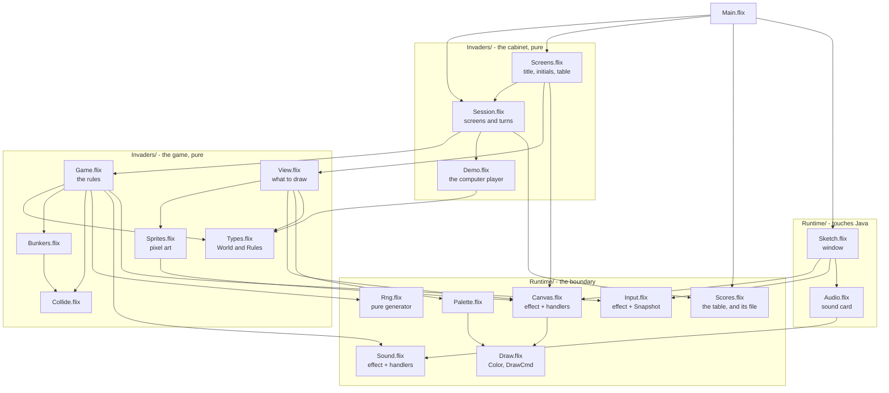
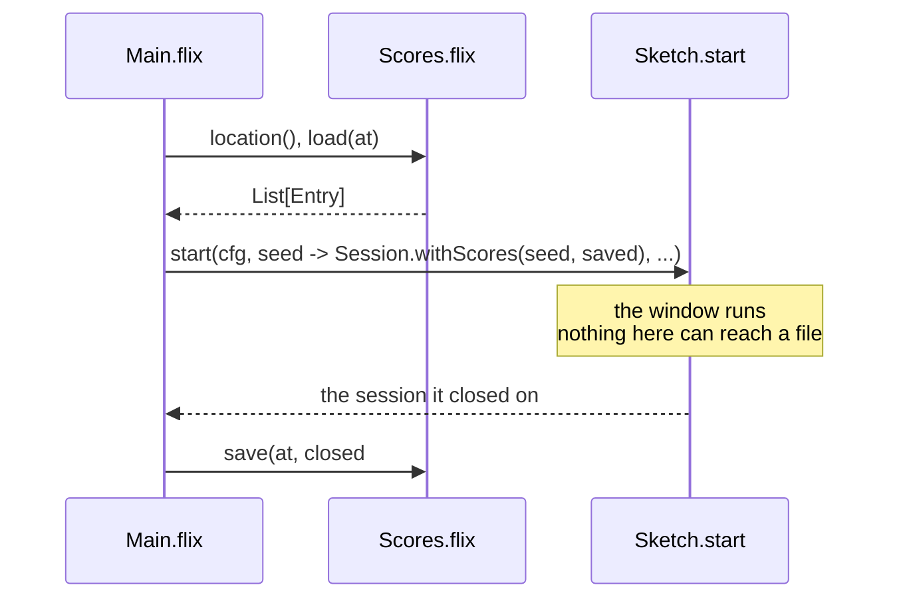
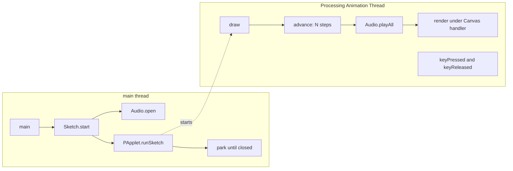
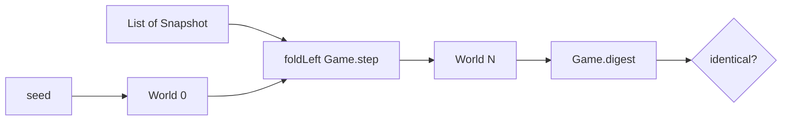
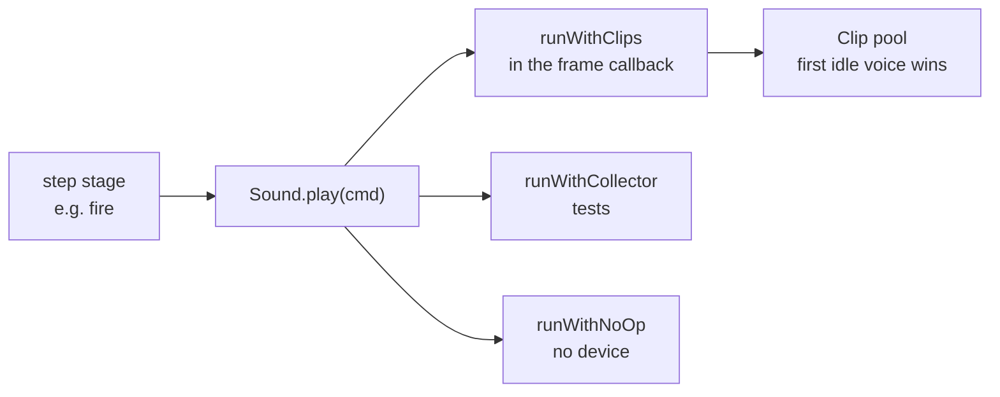
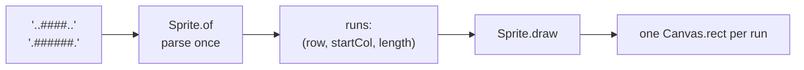

# Architecture

Why each boundary sits where it does, and what it buys.

The short version: **the rules are a pure function, drawing is an effect with several
interpretations, and exactly two files may touch Java.** Everything else follows from those
three commitments.

---

## Module graph

Arrows point from a module to what it depends on. Nothing in `Invaders/` or `Sketches/` can
reach `Sketch.flix` or `Audio.flix` — that direction does not exist.



`Types.flix` holds both the `World` and the `Rules` module — every tunable constant in one
place, so the game can be retuned without hunting through logic.

---

## The three layers

### 1. Pure (`Invaders/`, `Sketches/`)

No `IO`, no window, no device — enforced by types, not convention. `Game.step` is:

```flix
pub def step(world: World, input: Snapshot): World \ Sound
```

One effect, and it is the one the rules genuinely have: saying what should be heard. There is
no `IO` in that row, so `step` cannot read a clock, open a file, or draw. Everything else it
needs — including the random number generator — is a field on `World`.

### 2. The boundary (`Runtime/Canvas`, `Input`, `Sound`, `Fs`)

Three effects of our own, plus the standard library's filesystem effects at the very edge:

| | Kind | Why |
|---|---|---|
| `Canvas` | effect | Drawing reads naturally as a sequence of commands, and several interpretations are genuinely useful |
| `Input` | effect | A `poll` that returns the same frozen snapshot all step |
| `Sound` | effect | The rules say what should be heard; three interpretations decide how |
| `Fs.FileRead`, `Fs.FileWrite` | stdlib effects | Reached only by `main`, and only for the high-score file |

`Rng` is the one thing that stayed data — see *Sound: data or effect?* below for why the two
went different ways.

The filesystem effects are the one place where the type system does *not* protect us:
both carry `@DefaultHandler`, so a test that forgets a handler compiles and writes to the
real disk. CI greps for it. See *Persistence* below.

### 3. Touching Java (`Runtime/Sketch`, `Runtime/Audio`)

`Sketch.flix` owns the window, the frame loop, key tracking and the Processing lifecycle.
`Audio.flix` owns waveform synthesis and a pool of `javax.sound.sampled` clips. Nothing else
in `src/` imports a Java class.

`Main.flix` is a third file that reaches outside the process, though not through Java: it
reads and writes the high-score file through `Fs`. See *Persistence*.

---

## Persistence

One text file, `NAME|SCORE|LEVEL` per line, in `$XDG_CONFIG_HOME/flix-invaders/scores.txt` or
`~/.config/flix-invaders/scores.txt`.

The whole of it is arranged so that exactly one function can touch a disk:



`Sketch.start`'s `init` stays a pure `Int64 -> s`; the loaded table is captured in a closure
around it. `start` returns the state the window closed on, which is the only reason it returns
anything at all. Everything in between — `Session.step`, the screens, the rules — is unchanged
and still has no idea a filesystem exists.

Two decisions worth naming:

- **A missing file is not an error.** `load` translates `NotFound` to an empty table and
  passes every other error through. Collapsing them with `Result.getWithDefault` would mean a
  table you merely lacked permission to *read* got silently overwritten with nothing on the
  way out.
- **A damaged line costs you that line.** `parse` drops what it cannot read rather than
  failing. Hand-editing the file should cost you some scores, not the game.

### The hazard

`Fs.FileRead` and `Fs.FileWrite` both carry `@DefaultHandler`, and the default writes to the
real disk. A test that simply forgets to install a handler therefore **compiles and passes**,
having scribbled on the machine that ran it. This is the one place in the project where the
type system does not catch the mistake, so CI does:

```
any file in test/ that names `Fs.` must also name `withInMemoryFS`
```

`TestScoresFile.flix` is the only such file. It runs on `Fs.FileSystem.withInMemoryFS`, and
handles the residual `Clock` with a frozen one, so the filesystem tests do not even read the
machine's time.

---

## Threading



Three facts make this safe:

- **`runSketch` returns immediately.** The enclosing region would exit while `draw` is still
  using its `Ref`s, so `main` parks until the sketch reports it has closed.
- **Key events are drained after `draw` returns, on the same thread.** Processing queues
  them, so the held-key set is only mutated between frames and needs no locking. This holds
  *only* while `noLoop()` is never called — under `noLoop` events dispatch on the EDT
  instead. The runtime never calls it.
- **Effect handlers are stack-scoped.** A handler installed around `runSketch` on the main
  thread is invisible inside `draw`. Both the `Canvas` handler and the audio flush are
  therefore installed *inside* the callback, every frame.

---

## Determinism

The property everything else is arranged to protect: **a world plus a list of input
snapshots completely determines every world that follows.**



Three things had to be true for this to hold:

1. **A fixed timestep.** Each step covers exactly 1/60 s, so a slow frame runs more steps
   rather than longer ones. `System.nanoTime` — not `Time.Clock`, whose handler is
   wall-clock `currentTimeMillis` and can jump backwards on an NTP correction.
2. **Input frozen once per frame.** Every step within a frame sees the same `Snapshot`.
3. **Randomness as a value.** `Rng` is a field on `World`, threaded through `step` and
   returned with the new world.

[TestReplay.flix](../test/TestReplay.flix) checks all of it, including that splitting 600
steps into two batches of 300 changes nothing — which would fail if any hidden state existed.

`Game.digest` is a string rendering of a whole world, used for those comparisons. It exists
because Flix records have no `Eq` instance; see *Rejected alternatives*.

---

## Sound: data or effect?

<a id="sound-data-or-effect"></a>

Each stage appends to `World.sounds`, cleared at the top of every step, and the runtime plays
whatever the tick produced.

**This is a choice, and the close one in the whole design.** An earlier version of this
document claimed sound *had* to be data because `step` is pure — which is circular, since
`step`'s purity is itself the choice. The constraint actually encountered was that
`Sketch.start` cannot be polymorphic over effect *variables*; a **concrete** effect on `step`,
handled inside the anonymous `PApplet` callback, compiles fine. It was tested:

```flix
pub def start(init: (Int64 -> s),
              step: ((s, Int32) -> s \ Beep),   // concrete effect -- compiles
              view: (s -> Unit \ Canvas)): Unit \ IO
```

So the real trade-off:

| | data (today) | effect |
|---|---|---|
| `Game.step` type | `(World, Snapshot) -> World`, no effect row | `\ Sound` |
| `TestReplay` | folds `Game.step` directly | must install a handler |
| `World.sounds` | a field holding *output*, cleared every step, in the digest | gone |
| Collection across a frame | runtime accumulates per step into a `pending` Ref | handler accumulates naturally |
| Symmetry with `Canvas` | needs this section to explain | none needed |

`World.sounds` is the tell: it is output, not state. The effect is the more idiomatic design
and probably the better one. What data buys is that `step` has *literally no effect row* --
the strongest form of the property this project advertises -- and that replay determinism is
structural rather than dependent on which handler someone installed.



Consequences:

- Tests assert on sound with **no audio device** — they install a collector.
- A machine with no sound card runs the identical simulation.
- The march bassline is spaced by *distance marched*, not by a timer, so its tempo tracks the
  formation's speed-up with no extra state.

`AudioSystem` throws an unchecked `IllegalArgumentException` when no mixer exists — not the
declared `LineUnavailableException` — so every entry point in `Audio.flix` catches `Exception`
and degrades to silence.

---

## Rendering

Sprites are text. `Sprite.of` parses rows of `#` and `.` **once**, collapsing each row into
horizontal runs, and stores them:



Run-merging is not cosmetic. An intact bunker is 96 blocks but about a dozen runs, and
parsing per invader per frame instead of once cost roughly half the frame rate when measured.

**Measured cost** (bracketing the work inside `draw` with `nanoTime`, not wall-clock — see
below): simulation 0.13 ms, drawing 1.74 ms, about **1.9 ms of a 16.7 ms budget**.

> Do not measure frame cost with a stopwatch. Processing sleeps to hold the target frame
> rate, so timing a run of N frames measures the rate limiter and not the work — any sketch
> inside budget reports ~16.7 ms whether it uses 1 ms or 15 ms.

---

## Rejected alternatives

Recorded because each looks obviously right and is not.

| Alternative | Why not |
|---|---|
| `World` as a single-case enum wrapping a record | Looks free and has stdlib precedent (`Net/HttpRequest.flix`). But `pub enum W({...}) with Eq` **does not compile** — records have no `Eq` for the derivation to build on, so it would mean hand-writing a 24-field instance, against 751 field-select sites. Tested and rejected. |
| The stdlib `Random` effect instead of `Rng` data | Weaker than it first appears. `Sketch.start` cannot be polymorphic over effect variables, but a *concrete* effect on `step` compiles. The reason that survives: `handleWithSeed` builds a fresh generator per invocation, so installing it per frame restarts the sequence — you would have to write a handler over a persistent generator, and determinism would then depend on which handler was installed rather than on the types. |
| `@DefaultHandler` on `Canvas` / `Input` | The only sensible default is a silent no-op, which would let a test that forgot to choose an interpretation compile and assert on a frame nobody drew. Leaving them undefaulted keeps that a type error. |
| Datalog in the frame loop | All 25 stdlib examples are whole-relation fixpoints over static facts, and the engine re-stratifies per solve with no incremental API. Reasonable at level-load time; malpractice at 60 Hz. |
| The Processing Sound library | Not on Maven Central; the JitPack artifact contains zero classes. Would require republishing LGPL and Apache jars from this repo. `javax.sound.sampled` gives the same arcade bleeps with no dependency. |
| `flix build-fatjar` for release | It shades `processing-core.jar`, converting dynamic linking into static and triggering LGPL-2.1 §6's relinking obligation. See [THIRD-PARTY.md](../THIRD-PARTY.md). |

---

## Toolchain

`bin/flix` downloads the compiler version pinned in `flix.toml` into `.flix/` once and reuses
it, so local runs and CI are identical. Processing Core is a single pinned jar fetched from
Maven Central — `[jar-dependencies]`, not `[mvn-dependencies]`, because core's POM drags in
JOGL umbrella artifacts and a Kotlin stdlib that the JAVA2D renderer never loads. Verified at
runtime with `-verbose:class`: no `com.jogamp` class is ever loaded.

CI runs `check`, `test`, a formatting gate, and a grep asserting no test opens a window or an
audio device. A separate smoke workflow launches every sketch on Linux (under Xvfb), macOS
and Windows and checks it starts, draws and exits cleanly.

## See also

- [spike-result.md](spike-result.md) — the integration spike, and the classloader problem
  that nearly blocked it
- [SMOKE-CHECKLIST.md](SMOKE-CHECKLIST.md) — the manual per-platform test
- [../AGENTS.md](../AGENTS.md) — the gotchas, each of which cost real debugging time
