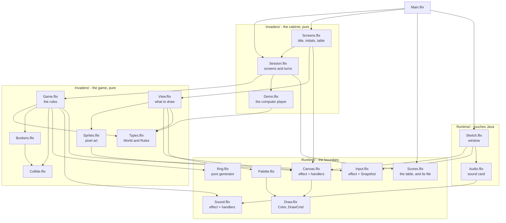
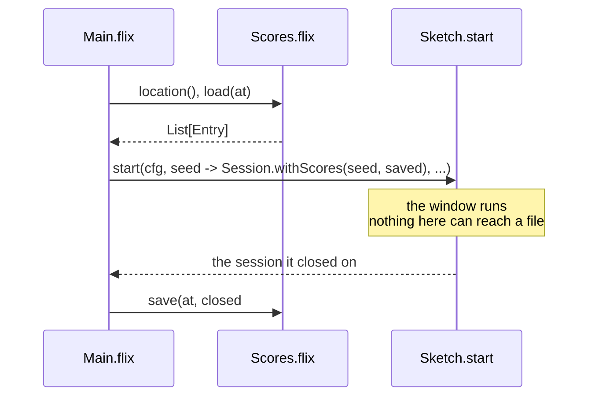
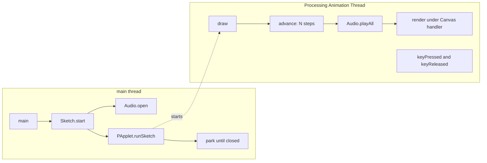
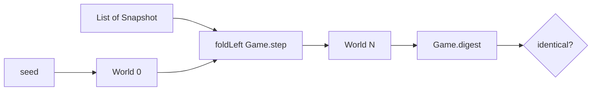
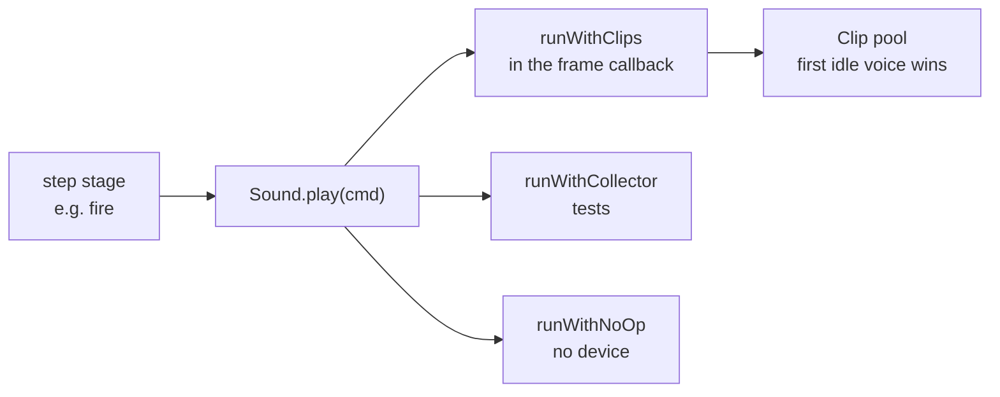
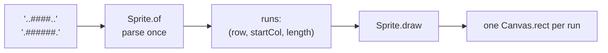

# Architecture

Why each boundary sits where it does, and what it buys.

The short version: **the rules are a pure function, drawing is an effect with several
interpretations, and exactly two files may touch Java.** Everything else follows from those
three commitments.

---

## Module graph

Arrows point from a module to what it depends on. Nothing in `Invaders/` or `Sketches/` can
reach `Sketch.flix` or `Audio.flix` — that direction does not exist.



`Types.flix` holds both the `World` and the `Rules` module — every tunable constant in one
place, so the game can be retuned without hunting through logic.

---

## The three layers

### 1. Pure (`Invaders/`, `Sketches/`)

No `IO`, no window, no device — enforced by types, not convention. `Game.step` is:

```flix
pub def step(world: World, input: Snapshot): World \ Sound
```

One effect, and it is the one the rules genuinely have: saying what should be heard. There is
no `IO` in that row, so `step` cannot read a clock, open a file, or draw. Everything else it
needs — including the random number generator — is a field on `World`.

### 2. The boundary (`Runtime/Canvas`, `Input`, `Sound`, `Fs`)

Three effects of our own, plus the standard library's filesystem effects at the very edge:

| | Kind | Why |
|---|---|---|
| `Canvas` | effect | Drawing reads naturally as a sequence of commands, and several interpretations are genuinely useful |
| `Input` | effect | A `poll` that returns the same frozen snapshot all step |
| `Sound` | effect | The rules say what should be heard; three interpretations decide how |
| `Fs.FileRead`, `Fs.FileWrite` | stdlib effects | Reached only by `main`, and only for the high-score file |

`Rng` is the one thing that stayed data — see *Sound: data or effect?* below for why the two
went different ways.

The filesystem effects are the one place where the type system does *not* protect us:
both carry `@DefaultHandler`, so a test that forgets a handler compiles and writes to the
real disk. CI greps for it. See *Persistence* below.

### 3. Touching Java (`Runtime/Sketch`, `Runtime/Audio`)

`Sketch.flix` owns the window, the frame loop, key tracking and the Processing lifecycle.
`Audio.flix` owns waveform synthesis and a pool of `javax.sound.sampled` clips. Nothing else
in `src/` imports a Java class.

`Main.flix` is a third file that reaches outside the process, though not through Java: it
reads and writes the high-score file through `Fs`. See *Persistence*.

---

## Persistence

One text file, `NAME|SCORE|LEVEL` per line, in `$XDG_CONFIG_HOME/flix-invaders/scores.txt` or
`~/.config/flix-invaders/scores.txt`.

The whole of it is arranged so that exactly one function can touch a disk:



`Sketch.start`'s `init` stays a pure `Int64 -> s`; the loaded table is captured in a closure
around it. `start` returns the state the window closed on, which is the only reason it returns
anything at all. Everything in between — `Session.step`, the screens, the rules — is unchanged
and still has no idea a filesystem exists.

Two decisions worth naming:

- **A missing file is not an error.** `load` translates `NotFound` to an empty table and
  passes every other error through. Collapsing them with `Result.getWithDefault` would mean a
  table you merely lacked permission to *read* got silently overwritten with nothing on the
  way out.
- **A damaged line costs you that line.** `parse` drops what it cannot read rather than
  failing. Hand-editing the file should cost you some scores, not the game.

### The hazard

`Fs.FileRead` and `Fs.FileWrite` both carry `@DefaultHandler`, and the default writes to the
real disk. A test that simply forgets to install a handler therefore **compiles and passes**,
having scribbled on the machine that ran it. This is the one place in the project where the
type system does not catch the mistake, so CI does:

```
any file in test/ that names `Fs.` must also name `withInMemoryFS`
```

`TestScoresFile.flix` is the only such file. It runs on `Fs.FileSystem.withInMemoryFS`, and
handles the residual `Clock` with a frozen one, so the filesystem tests do not even read the
machine's time.

---

## Threading



Three facts make this safe:

- **`runSketch` returns immediately.** The enclosing region would exit while `draw` is still
  using its `Ref`s, so `main` parks until the sketch reports it has closed.
- **Key events are drained after `draw` returns, on the same thread.** Processing queues
  them, so the held-key set is only mutated between frames and needs no locking. This holds
  *only* while `noLoop()` is never called — under `noLoop` events dispatch on the EDT
  instead. The runtime never calls it.
- **Effect handlers are stack-scoped.** A handler installed around `runSketch` on the main
  thread is invisible inside `draw`. Both the `Canvas` handler and the audio flush are
  therefore installed *inside* the callback, every frame.

---

## Determinism

The property everything else is arranged to protect: **a world plus a list of input
snapshots completely determines every world that follows.**



Three things had to be true for this to hold:

1. **A fixed timestep.** Each step covers exactly 1/60 s, so a slow frame runs more steps
   rather than longer ones. `System.nanoTime` — not `Time.Clock`, whose handler is
   wall-clock `currentTimeMillis` and can jump backwards on an NTP correction.
2. **Input frozen once per frame.** Every step within a frame sees the same `Snapshot`.
3. **Randomness as a value.** `Rng` is a field on `World`, threaded through `step` and
   returned with the new world.

[TestReplay.flix](../test/TestReplay.flix) checks all of it, including that splitting 600
steps into two batches of 300 changes nothing — which would fail if any hidden state existed.

`Game.digest` is a string rendering of a whole world, used for those comparisons. It exists
because Flix records have no `Eq` instance; see *Rejected alternatives*.

---

## Sound: data or effect?

<a id="sound-data-or-effect"></a>

Each stage appends to `World.sounds`, cleared at the top of every step, and the runtime plays
whatever the tick produced.

**This is a choice, and the close one in the whole design.** An earlier version of this
document claimed sound *had* to be data because `step` is pure — which is circular, since
`step`'s purity is itself the choice. The constraint actually encountered was that
`Sketch.start` cannot be polymorphic over effect *variables*; a **concrete** effect on `step`,
handled inside the anonymous `PApplet` callback, compiles fine. It was tested:

```flix
pub def start(init: (Int64 -> s),
              step: ((s, Int32) -> s \ Beep),   // concrete effect -- compiles
              view: (s -> Unit \ Canvas)): Unit \ IO
```

So the real trade-off:

| | data (today) | effect |
|---|---|---|
| `Game.step` type | `(World, Snapshot) -> World`, no effect row | `\ Sound` |
| `TestReplay` | folds `Game.step` directly | must install a handler |
| `World.sounds` | a field holding *output*, cleared every step, in the digest | gone |
| Collection across a frame | runtime accumulates per step into a `pending` Ref | handler accumulates naturally |
| Symmetry with `Canvas` | needs this section to explain | none needed |

`World.sounds` is the tell: it is output, not state. The effect is the more idiomatic design
and probably the better one. What data buys is that `step` has *literally no effect row* --
the strongest form of the property this project advertises -- and that replay determinism is
structural rather than dependent on which handler someone installed.



Consequences:

- Tests assert on sound with **no audio device** — they install a collector.
- A machine with no sound card runs the identical simulation.
- The march bassline is spaced by *distance marched*, not by a timer, so its tempo tracks the
  formation's speed-up with no extra state.

`AudioSystem` throws an unchecked `IllegalArgumentException` when no mixer exists — not the
declared `LineUnavailableException` — so every entry point in `Audio.flix` catches `Exception`
and degrades to silence.

---

## Rendering

Sprites are text. `Sprite.of` parses rows of `#` and `.` **once**, collapsing each row into
horizontal runs, and stores them:



Run-merging is not cosmetic. An intact bunker is 96 blocks but about a dozen runs, and
parsing per invader per frame instead of once cost roughly half the frame rate when measured.

**Measured cost** (bracketing the work inside `draw` with `nanoTime`, not wall-clock — see
below): simulation 0.13 ms, drawing 1.74 ms, about **1.9 ms of a 16.7 ms budget**.

> Do not measure frame cost with a stopwatch. Processing sleeps to hold the target frame
> rate, so timing a run of N frames measures the rate limiter and not the work — any sketch
> inside budget reports ~16.7 ms whether it uses 1 ms or 15 ms.

---

## Datalog, and where it does not belong

Flix has a first-class Datalog engine, and this project uses it in exactly one place:
[`TestScreenGraph.flix`](../test/TestScreenGraph.flix).

The cabinet's screens form a graph, and the properties worth asserting about it are
reachability properties — every screen can be got to, and no screen traps the player. Both are
transitive closure, so they are three rules and a `query` rather than a hand-rolled search:

```flix
Path(x, y) :- Edge(x, y).
Path(x, z) :- Path(x, y), Edge(y, z).
```

What makes it a real test rather than a restatement is where `Edge` comes from: the facts are
**discovered by running `Session.step`** over each screen and a spread of inputs. Typing the
transitions by hand would assert the author's belief about the state machine and keep passing
after somebody deleted the way out of `Table`. Deleting it for real strands three screens, not
one, and the closure says so.

Datalog was considered for the game itself and rejected. Every relational-looking thing in
`Game.step` — bullet × invader, bomb × player, bullet × bunker cell — is a **single
non-recursive join** with a geometric predicate. Written as rules they are the same joins
`List.filter` already does, plus marshalling float geometry into relations sixty times a
second, with no fixpoint to exploit in return. The one genuine fixpoint anybody proposed —
propagating danger over the positions the cannon can reach in time, as a lattice — is real,
but it sits in the hot loop, and the greedy one-step chooser in
[`Demo.bestSpot`](../src/Invaders/Demo.flix) already clears level four. It is a solver
replacing fourteen tested lines to buy something unmeasured.

The rule this leaves: **Datalog where the question is recursive, ordinary functions where it
is not.**

---

## Bunker camping

The cannon's shots erode the bunkers, exactly as in the arcade original, and that is what makes
the oldest trick in the game possible: drill a narrow channel through your own shelter, stand
in it, and shoot out while their bombs still break on the blocks either side.

It works here because the two craters differ:

| | Width | Crater radius |
|---|---|---|
| Cannon's shot | 4px | **2px** |
| Invader's bomb | 6px | 6px |

A 2px crater removes only the block it struck, so the channel is one block — 4px — wide. Your
own 4px shot fits; a 6px bomb always clips a standing block on one side. Measured across every
column of a bunker: a lane opens after about 150 ticks for 5 to 13 blocks, and the bomb is
stopped every time.

Three consequences worth knowing:

- **Alignment matters.** A shot on the *seam* between two columns straddles both and drills a
  channel twice as wide, which a bomb fits through. Camping requires lining up.
- **The clock is running.** `bombCrater` stays at 6px, so the enemy tears your shelter down
  faster than you carve it. Camping is a tactic with a time limit, not a place to live.
- **The bot does not do this.** It refuses to fire through its own cover at all, which costs
  it nothing measurable — level 4.8 either way — and keeps its behaviour legible. Teaching it
  to drill deliberately is open work.

---

## Finishing a flank

Left to shoot the lowest invader and nothing else, the bot digs a hole through the middle of
the formation and leaves a single survivor in each outer column. Measured over level 1, the
block stays **400px wide from eleven columns down to six** — the stragglers on the flanks hold
it at full width, and width is what decides how far it marches before it turns and drops.

It never takes those shots on its own, because a lone survivor on the flank is high up and so
scores badly on imminence. `Demo.finishFlank` is the exception: an outer column with exactly
one invader left outranks everything, because that is one shot for a permanent reduction in the
descent rate — the best value on the board.

It is deliberately the narrowest possible rule, and both bounds cost real levels:

| Rule | Mean level | Block width at tick 900 |
|---|---|---|
| No flank rule at all | 4.9 | 360 |
| **Finish when one remains** | **4.5** | **280** |
| Finish when two remain | 3.9 | 200 |

And it switches off as the formation descends (`composure`). Tidying up only pays while there
is a level left to spend the slower descent on; once the front row is near the bottom, the
lowest row is both the thing about to land and the thing dropping the bombs. Letting the bot
keep tidying to three-quarters of the way down costs a whole level on the unlucky seeds — worst
case 3 rather than 4 — for no extra narrowing.

The half-level given up against pure lowest-first buys play that looks like a person's. For an
attract screen that is the trade worth making; for a bot whose only job was to reach level 9 it
would not be.

---

## Measuring the bot

The demo player carries about a dozen interacting constants, and the record of tuning them is
a record of intuition being wrong:

| Change | Expected | Measured |
|---|---|---|
| Widen the threat corridor 30px → 60px | a small gain | **deaths 24 → 4** |
| Predict where the cannon will be when each bomb lands | clearly better | *worse*, at every tuning |
| Weight the formation's flanks | slower descent, better play | slower descent, **lower** levels |
| Ignore bombs the shield will stop | a little free time | mean level 4.5 → 4.8 |

So the constants are measured rather than argued about. [`bin/bench`](../bin/bench) plays ten
fixed seeds to completion and reports per-seed outcomes plus aggregate rates. It is pure —
`Game.step` and the bot are both pure functions — so the same build always produces the same
numbers, and any difference between builds is the change under test.

Three rules it enforces, each of which was learned by getting it wrong:

- **Rates, never totals.** A change that ends games sooner posts fewer deaths and fewer row
  drops while being strictly worse.
- **One stopping condition.** Nothing may stop a run early on something the change under test
  could itself affect. A bunker-damage measurement once reported every bunker perfectly intact
  because it stopped at the level change — which resets them.
- **Report the worst seed, not just the mean.** Bomb luck moves a single seed by two levels,
  and a tuning that lifts the mean while collapsing one seed is a bad trade.

[`TestBench`](../test/TestBench.flix) tests the arithmetic rather than the bot. A benchmark
that reports the wrong number is worse than none: it is a confident wrong answer, and every
decision downstream inherits it.

---

## Rejected alternatives

Recorded because each looks obviously right and is not.

| Alternative | Why not |
|---|---|
| `World` as a single-case enum wrapping a record | Looks free and has stdlib precedent (`Net/HttpRequest.flix`). But `pub enum W({...}) with Eq` **does not compile** — records have no `Eq` for the derivation to build on, so it would mean hand-writing a 24-field instance, against 751 field-select sites. Tested and rejected. |
| The stdlib `Random` effect instead of `Rng` data | Weaker than it first appears. `Sketch.start` cannot be polymorphic over effect variables, but a *concrete* effect on `step` compiles. The reason that survives: `handleWithSeed` builds a fresh generator per invocation, so installing it per frame restarts the sequence — you would have to write a handler over a persistent generator, and determinism would then depend on which handler was installed rather than on the types. |
| `@DefaultHandler` on `Canvas` / `Input` | The only sensible default is a silent no-op, which would let a test that forgot to choose an interpretation compile and assert on a frame nobody drew. Leaving them undefaulted keeps that a type error. |
| Datalog in the frame loop | All 25 stdlib examples are whole-relation fixpoints over static facts, and the engine re-stratifies per solve with no incremental API. Reasonable at level-load time; malpractice at 60 Hz. |
| Chasing the formation's flanks in general | Narrowing the block is real and large — `Game.liveBounds` measures the formation from its *living* invaders, so emptying an outer column widens the runway and cuts level 1 from 5-6 row drops per 1000 ticks to 3. But weighting flanks *generally* loses under every condition tried: a 1000-point bonus life (4.5 plain against 3.8-4.2), a 2500-point one (4.8 against 3.6-4.0), and after the dodging was fixed so the bot stopped dying to bombs entirely (4.9 against 3.9-4.4). Reaching level N means **clearing** N-1 formations, so the race is kill rate against descent rate, and general flank-chasing costs more of the former than it buys of the latter. What *is* worth doing is the narrow case — see *Finishing a flank* below. An "invaders passed en route" bonus is separately catastrophic (level 1.1), because the most distant target has the most on the way to it and the cannon gets dragged across the field. |
| Predicting where the cannon will be when a bomb lands | The dodge scores a destination as though the cannon teleported there, which is plainly wrong — 96px of travel is 24 ticks, and every bomb falls 72px in that time. Replacing it with a model that works out when each bomb reaches the cannon's line and where the cannon will have got to by then made things **worse** at every tuning: 32-35 deaths against 24, and level 4.0-4.3 against 4.8. The flaw is that `bestSpot` re-decides every tick, so "where I will be" assumes a commitment the bot never makes; being optimistic about its own future movement, it concluded it would have left already and stood still. The naive destination-scored model is pessimistic, and pessimism is what a re-planning agent needs. Widening `dangerWidth` from 30 to 60 — reacting earlier rather than predicting better — cut deaths from 24 to 4. |
| A single blast radius for both shots | Was `blastRadius() = 6.0` for everything, and it quietly killed the arcade's oldest trick. Every absorbed shot cratered a 12px hole, twice a bomb's width, so a channel drilled through your own shelter was a channel a bomb could drop down — measured: a bomb down a freshly drilled lane left the blocks untouched at 245 and took a life. Now split into `bulletCrater = 2.0` and `bombCrater = 6.0`. The asymmetry is the point, not an accident of tuning: your shot drills, theirs demolishes. |
| The Processing Sound library | Not on Maven Central; the JitPack artifact contains zero classes. Would require republishing LGPL and Apache jars from this repo. `javax.sound.sampled` gives the same arcade bleeps with no dependency. |
| `flix build-fatjar` for release | It shades `processing-core.jar`, converting dynamic linking into static and triggering LGPL-2.1 §6's relinking obligation. See [THIRD-PARTY.md](../THIRD-PARTY.md). |

---

## Toolchain

`bin/flix` downloads the compiler version pinned in `flix.toml` into `.flix/` once and reuses
it, so local runs and CI are identical. Processing Core is a single pinned jar fetched from
Maven Central — `[jar-dependencies]`, not `[mvn-dependencies]`, because core's POM drags in
JOGL umbrella artifacts and a Kotlin stdlib that the JAVA2D renderer never loads. Verified at
runtime with `-verbose:class`: no `com.jogamp` class is ever loaded.

CI runs `check`, `test`, a formatting gate, and a grep asserting no test opens a window or an
audio device. A separate smoke workflow launches every sketch on Linux (under Xvfb), macOS
and Windows and checks it starts, draws and exits cleanly.

## See also

- [spike-result.md](spike-result.md) — the integration spike, and the classloader problem
  that nearly blocked it
- [SMOKE-CHECKLIST.md](SMOKE-CHECKLIST.md) — the manual per-platform test
- [../AGENTS.md](../AGENTS.md) — the gotchas, each of which cost real debugging time
